# 用户端历史订单模块

## 1. 查询历史订单

### 1.1 需求分析和设计

产品原型：

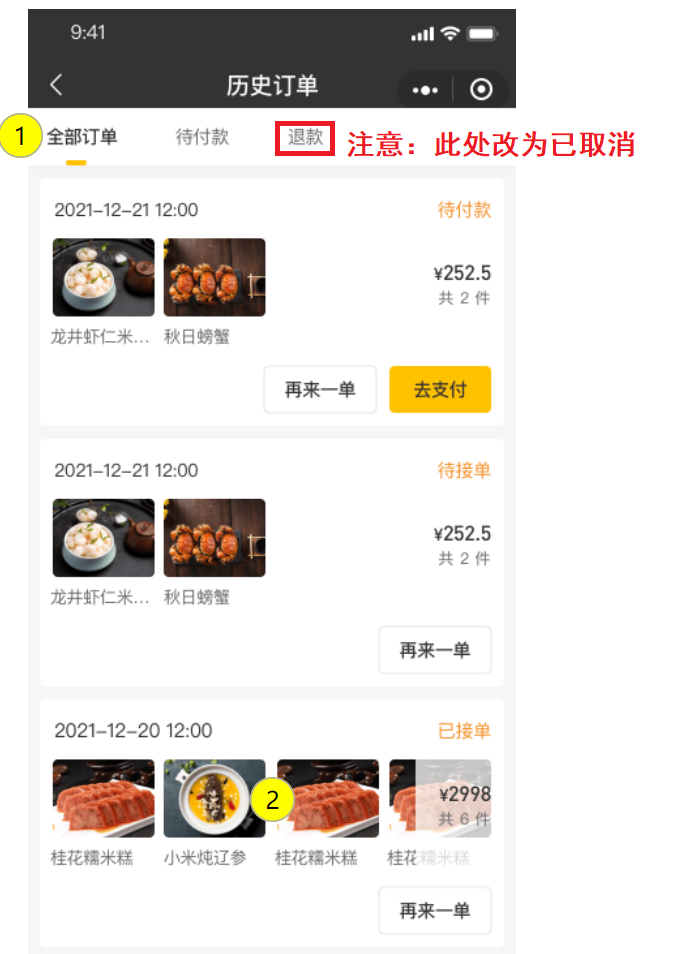

业务规则

- 分页查询历史订单
- 可以根据订单状态查询
- 展示订单数据时，需要展示的数据包括：下单时间、订单状态、订单金额、订单明细（商品名称、图片）

接口设计：参见接口文档

### 1.2 代码实现

#### 1.2.1 user/OrderController

~~~java
    /**
     * 历史订单查询
     *
     * @param page
     * @param pageSize
     * @param status   订单状态 1待付款 2待接单 3已接单 4派送中 5已完成 6已取消
     * @return
     */
    @GetMapping("/historyOrders")
    @ApiOperation("历史订单查询")
    public Result<PageResult> page(int page, int pageSize, Integer status) {
        PageResult pageResult = orderService.pageQuery4User(page, pageSize, status);
        return Result.success(pageResult);
    }
~~~

#### 1.2.2 OrderService

~~~java
    /**
     * 用户端订单分页查询
     * @param page
     * @param pageSize
     * @param status
     * @return
     */
    PageResult pageQuery4User(int page, int pageSize, Integer status);
~~~

#### 1.2.3 OrderServiceImpl

~~~java
/**
     * 用户端订单分页查询
     *
     * @param pageNum
     * @param pageSize
     * @param status
     * @return
     */
    public PageResult pageQuery4User(int pageNum, int pageSize, Integer status) {
        // 设置分页
        PageHelper.startPage(pageNum, pageSize);

        OrdersPageQueryDTO ordersPageQueryDTO = new OrdersPageQueryDTO();
        ordersPageQueryDTO.setUserId(BaseContext.getCurrentId());
        ordersPageQueryDTO.setStatus(status);

        // 分页条件查询
        Page<Orders> page = orderMapper.pageQuery(ordersPageQueryDTO);

        List<OrderVO> list = new ArrayList();

        // 查询出订单明细，并封装入OrderVO进行响应
        if (page != null && page.getTotal() > 0) {
            for (Orders orders : page) {
                Long orderId = orders.getId();// 订单id

                // 查询订单明细
                List<OrderDetail> orderDetails = orderDetailMapper.getByOrderId(orderId);

                OrderVO orderVO = new OrderVO();
                BeanUtils.copyProperties(orders, orderVO);
                orderVO.setOrderDetailList(orderDetails);

                list.add(orderVO);
            }
        }
        return new PageResult(page.getTotal(), list);
    }
~~~

#### 1.2.4 OrderMapper

~~~java
    /**
     * 分页条件查询并按下单时间排序
     * @param ordersPageQueryDTO
     */
    Page<Orders> pageQuery(OrdersPageQueryDTO ordersPageQueryDTO);
~~~

#### 1.2.5 OrderMapper.xml

~~~xml
	<select id="pageQuery" resultType="Orders">
        select * from orders
        <where>
            <if test="number != null and number!=''">
                and number like concat('%',#{number},'%')
            </if>
            <if test="phone != null and phone!=''">
                and phone like concat('%',#{phone},'%')
            </if>
            <if test="userId != null">
                and user_id = #{userId}
            </if>
            <if test="status != null">
                and status = #{status}
            </if>
            <if test="beginTime != null">
                and order_time &gt;= #{beginTime}
            </if>
            <if test="endTime != null">
                and order_time &lt;= #{endTime}
            </if>
        </where>
        order by order_time desc
    </select>
~~~

#### 1.2.6 OrderDetailMapper

~~~java
    /**
     * 根据订单id查询订单明细
     * @param orderId
     * @return
     */
    @Select("select * from order_detail where order_id = #{orderId}")
    List<OrderDetail> getByOrderId(Long orderId);
~~~

### 1.3 功能测试

略

## 2. 查询订单详情

### 2.1 需求分析和设计

产品原型：

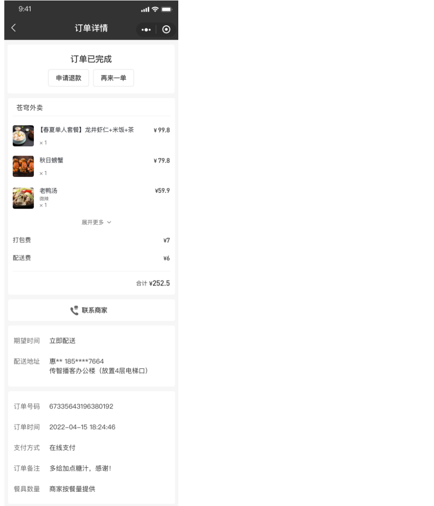

接口设计：参见接口文档

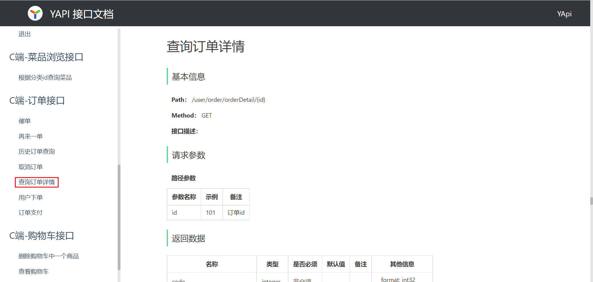

### 2.2 代码实现

#### 2.2.1 user/OrderController

~~~java
    /**
     * 查询订单详情
     *
     * @param id
     * @return
     */
    @GetMapping("/orderDetail/{id}")
    @ApiOperation("查询订单详情")
    public Result<OrderVO> details(@PathVariable("id") Long id) {
        OrderVO orderVO = orderService.details(id);
        return Result.success(orderVO);
    }
~~~

#### 2.2.2 OrderService

~~~java
    /**
     * 查询订单详情
     * @param id
     * @return
     */
    OrderVO details(Long id);
~~~

#### 2.2.3 OrderServiceImpl

~~~java
    /**
     * 查询订单详情
     *
     * @param id
     * @return
     */
    public OrderVO details(Long id) {
        // 根据id查询订单
        Orders orders = orderMapper.getById(id);

        // 查询该订单对应的菜品/套餐明细
        List<OrderDetail> orderDetailList = orderDetailMapper.getByOrderId(orders.getId());

        // 将该订单及其详情封装到OrderVO并返回
        OrderVO orderVO = new OrderVO();
        BeanUtils.copyProperties(orders, orderVO);
        orderVO.setOrderDetailList(orderDetailList);

        return orderVO;
    }
~~~

#### 2.2.4 OrderMapper

~~~java
    /**
     * 根据id查询订单
     * @param id
     */
    @Select("select * from orders where id=#{id}")
    Orders getById(Long id);
~~~

### 2.3 功能测试

略

## 3. 取消订单

### 3.1 需求分析和设计

产品原型：

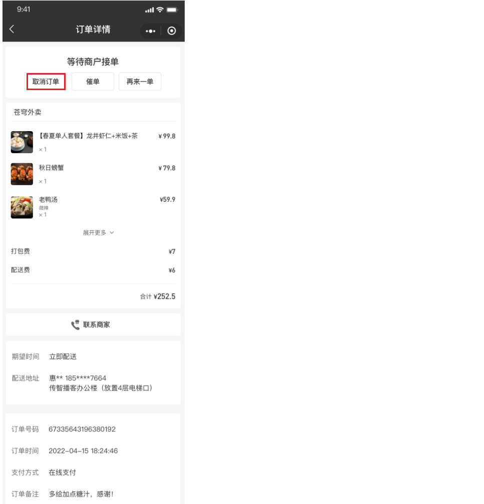

业务规则：

- 待支付和待接单状态下，用户可直接取消订单
- 商家已接单状态下，用户取消订单需电话沟通商家
- 派送中状态下，用户取消订单需电话沟通商家
- 如果在待接单状态下取消订单，需要给用户退款
- 取消订单后需要将订单状态修改为“已取消”

接口设计：参见接口文档

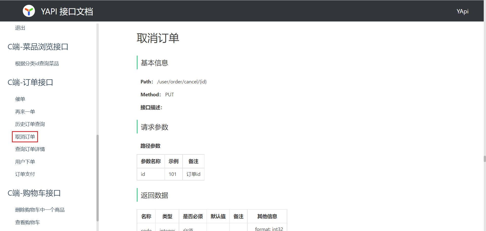

### 3.2 代码实现

#### 3.2.1 user/OrderController

~~~java
    /**
     * 用户取消订单
     *
     * @return
     */
    @PutMapping("/cancel/{id}")
    @ApiOperation("取消订单")
    public Result cancel(@PathVariable("id") Long id) throws Exception {
        orderService.userCancelById(id);
        return Result.success();
    }
~~~

#### 3.2.2 OrderService

~~~java
    /**
     * 用户取消订单
     * @param id
     */
    void userCancelById(Long id) throws Exception;
~~~

#### 3.2.3 OrderServiceImpl

~~~java
	/**
     * 用户取消订单
     *
     * @param id
     */
    public void userCancelById(Long id) throws Exception {
        // 根据id查询订单
        Orders ordersDB = orderMapper.getById(id);

        // 校验订单是否存在
        if (ordersDB == null) {
            throw new OrderBusinessException(MessageConstant.ORDER_NOT_FOUND);
        }

        //订单状态 1待付款 2待接单 3已接单 4派送中 5已完成 6已取消
        if (ordersDB.getStatus() > 2) {
            throw new OrderBusinessException(MessageConstant.ORDER_STATUS_ERROR);
        }

        Orders orders = new Orders();
        orders.setId(ordersDB.getId());

        // 订单处于待接单状态下取消，需要进行退款
        if (ordersDB.getStatus().equals(Orders.TO_BE_CONFIRMED)) {
            //调用微信支付退款接口
            weChatPayUtil.refund(
                    ordersDB.getNumber(), //商户订单号
                    ordersDB.getNumber(), //商户退款单号
                    new BigDecimal(0.01),//退款金额，单位 元
                    new BigDecimal(0.01));//原订单金额

            //支付状态修改为 退款
            orders.setPayStatus(Orders.REFUND);
        }

        // 更新订单状态、取消原因、取消时间
        orders.setStatus(Orders.CANCELLED);
        orders.setCancelReason("用户取消");
        orders.setCancelTime(LocalDateTime.now());
        orderMapper.update(orders);
    }
~~~

### 3.3 功能测试

略

## 4. 再来一单

### 4.1 需求分析和设计

产品原型：

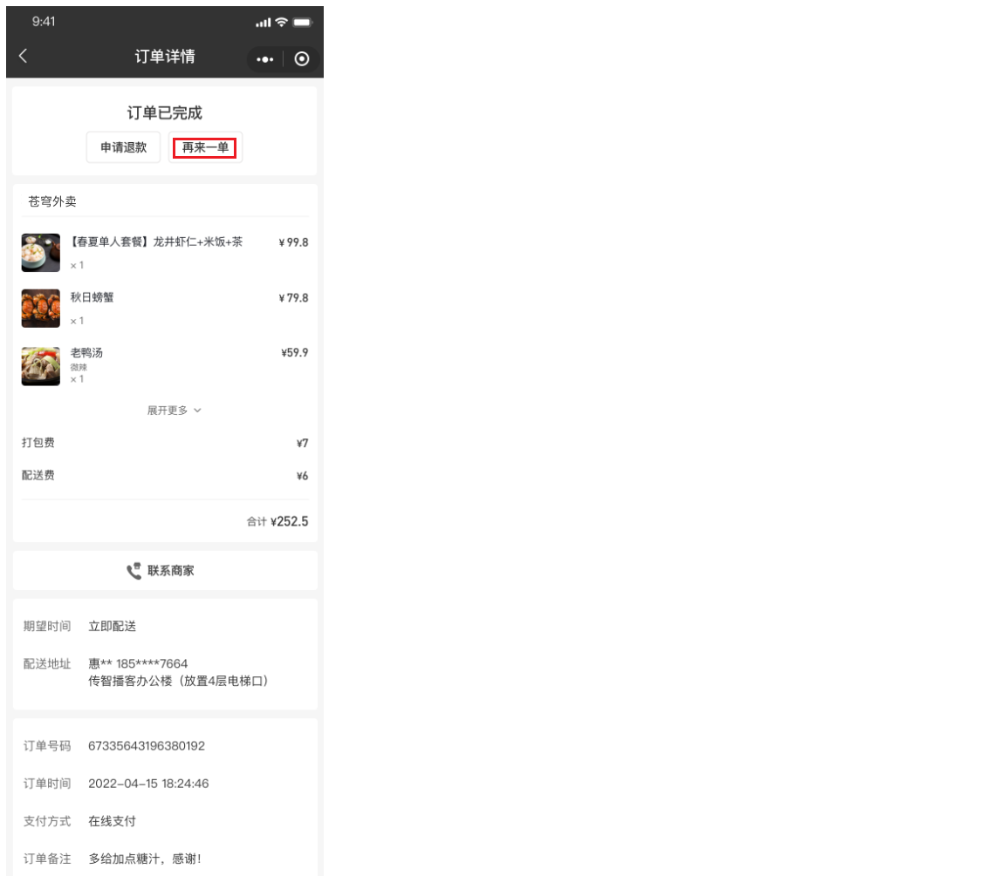

接口设计：参见接口文档

业务规则：

- 再来一单就是将原订单中的商品重新加入到购物车中

### 4.2 代码实现

#### 4.2.1 user/OrderController

~~~java
    /**
     * 再来一单
     *
     * @param id
     * @return
     */
    @PostMapping("/repetition/{id}")
    @ApiOperation("再来一单")
    public Result repetition(@PathVariable Long id) {
        orderService.repetition(id);
        return Result.success();
    }
~~~

#### 4.2.2 OrderService

~~~java
    /**
     * 再来一单
     *
     * @param id
     */
    void repetition(Long id);
~~~

#### 4.2.3 OrderServiceImpl

~~~java
	/**
     * 再来一单
     *
     * @param id
     */
    public void repetition(Long id) {
        // 查询当前用户id
        Long userId = BaseContext.getCurrentId();

        // 根据订单id查询当前订单详情
        List<OrderDetail> orderDetailList = orderDetailMapper.getByOrderId(id);

        // 将订单详情对象转换为购物车对象
        List<ShoppingCart> shoppingCartList = orderDetailList.stream().map(x -> {
            ShoppingCart shoppingCart = new ShoppingCart();

            // 将原订单详情里面的菜品信息重新复制到购物车对象中
            BeanUtils.copyProperties(x, shoppingCart, "id");
            shoppingCart.setUserId(userId);
            shoppingCart.setCreateTime(LocalDateTime.now());

            return shoppingCart;
        }).collect(Collectors.toList());

        // 将购物车对象批量添加到数据库
        shoppingCartMapper.insertBatch(shoppingCartList);
    }
~~~

#### 4.2.4 ShoppingCartMapper

~~~java
    /**
     * 批量插入购物车数据
     *
     * @param shoppingCartList
     */
    void insertBatch(List<ShoppingCart> shoppingCartList);
~~~

#### 4.2.5 ShoppingCartMapper.xml

~~~xml
<insert id="insertBatch" parameterType="list">
        insert into shopping_cart
        (name, image, user_id, dish_id, setmeal_id, dish_flavor, number, amount, create_time)
        values
        <foreach collection="shoppingCartList" item="sc" separator=",">
            (#{sc.name},#{sc.image},#{sc.userId},#{sc.dishId},#{sc.setmealId},#{sc.dishFlavor},#{sc.number},#{sc.amount},#{sc.createTime})
        </foreach>
</insert>
~~~

### 4.3 功能测试

略

# 商家端订单管理模块

## 1. 订单搜索

### 1.1 需求分析和设计

产品原型：

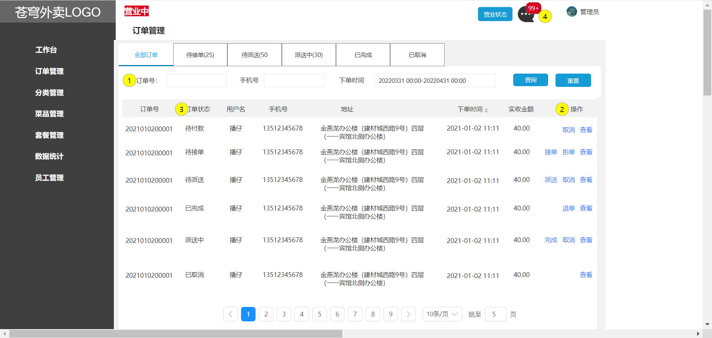

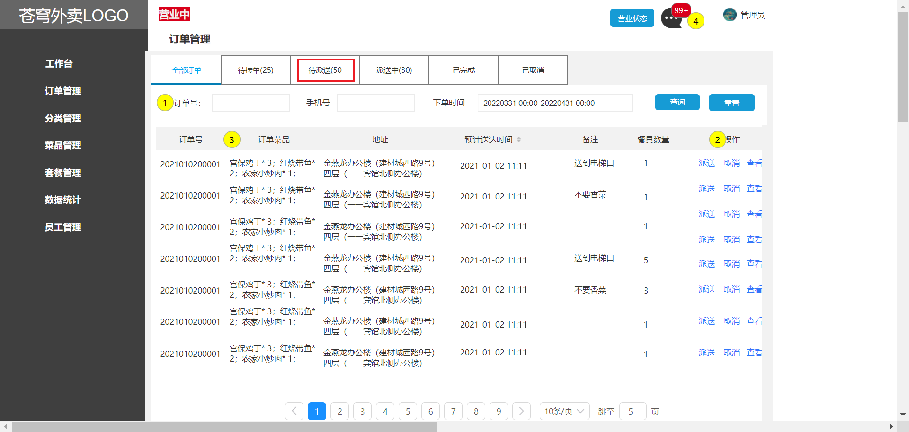

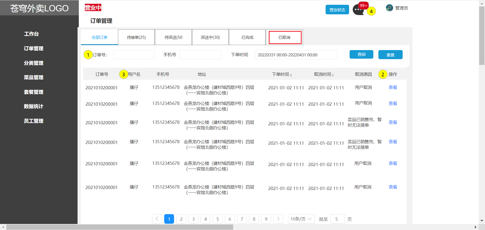

业务规则：

- 输入订单号/手机号进行搜索，支持模糊搜索
- 根据订单状态进行筛选
- 下单时间进行时间筛选
- 搜索内容为空，提示未找到相关订单
- 搜索结果页，展示包含搜索关键词的内容
- 分页展示搜索到的订单数据

接口设计：参见接口文档

### 1.2 代码实现

#### 1.2.1 admin/OrderController

在admin包下创建OrderController

~~~java
/**
 * 订单管理
 */
@RestController("adminOrderController")
@RequestMapping("/admin/order")
@Slf4j
@Api(tags = "订单管理接口")
public class OrderController {

    @Autowired
    private OrderService orderService;

    /**
     * 订单搜索
     *
     * @param ordersPageQueryDTO
     * @return
     */
    @GetMapping("/conditionSearch")
    @ApiOperation("订单搜索")
    public Result<PageResult> conditionSearch(OrdersPageQueryDTO ordersPageQueryDTO) {
        PageResult pageResult = orderService.conditionSearch(ordersPageQueryDTO);
        return Result.success(pageResult);
    }
}
~~~

#### 1.2.2 OrderService

~~~java
    /**
     * 条件搜索订单
     * @param ordersPageQueryDTO
     * @return
     */
    PageResult conditionSearch(OrdersPageQueryDTO ordersPageQueryDTO);
~~~

#### 1.2.3 OrderServiceImpl

~~~java
    /**
     * 订单搜索
     *
     * @param ordersPageQueryDTO
     * @return
     */
    public PageResult conditionSearch(OrdersPageQueryDTO ordersPageQueryDTO) {
        PageHelper.startPage(ordersPageQueryDTO.getPage(), ordersPageQueryDTO.getPageSize());

        Page<Orders> page = orderMapper.pageQuery(ordersPageQueryDTO);

        // 部分订单状态，需要额外返回订单菜品信息，将Orders转化为OrderVO
        List<OrderVO> orderVOList = getOrderVOList(page);

        return new PageResult(page.getTotal(), orderVOList);
    }

    private List<OrderVO> getOrderVOList(Page<Orders> page) {
        // 需要返回订单菜品信息，自定义OrderVO响应结果
        List<OrderVO> orderVOList = new ArrayList<>();

        List<Orders> ordersList = page.getResult();
        if (!CollectionUtils.isEmpty(ordersList)) {
            for (Orders orders : ordersList) {
                // 将共同字段复制到OrderVO
                OrderVO orderVO = new OrderVO();
                BeanUtils.copyProperties(orders, orderVO);
                String orderDishes = getOrderDishesStr(orders);

                // 将订单菜品信息封装到orderVO中，并添加到orderVOList
                orderVO.setOrderDishes(orderDishes);
                orderVOList.add(orderVO);
            }
        }
        return orderVOList;
    }

    /**
     * 根据订单id获取菜品信息字符串
     *
     * @param orders
     * @return
     */
    private String getOrderDishesStr(Orders orders) {
        // 查询订单菜品详情信息（订单中的菜品和数量）
        List<OrderDetail> orderDetailList = orderDetailMapper.getByOrderId(orders.getId());

        // 将每一条订单菜品信息拼接为字符串（格式：宫保鸡丁*3；）
        List<String> orderDishList = orderDetailList.stream().map(x -> {
            String orderDish = x.getName() + "*" + x.getNumber() + ";";
            return orderDish;
        }).collect(Collectors.toList());

        // 将该订单对应的所有菜品信息拼接在一起
        return String.join("", orderDishList);
    }
~~~

### 1.3 功能测试

略

## 2. 各个状态的订单数量统计

### 2.1 需求分析和设计

产品原型：

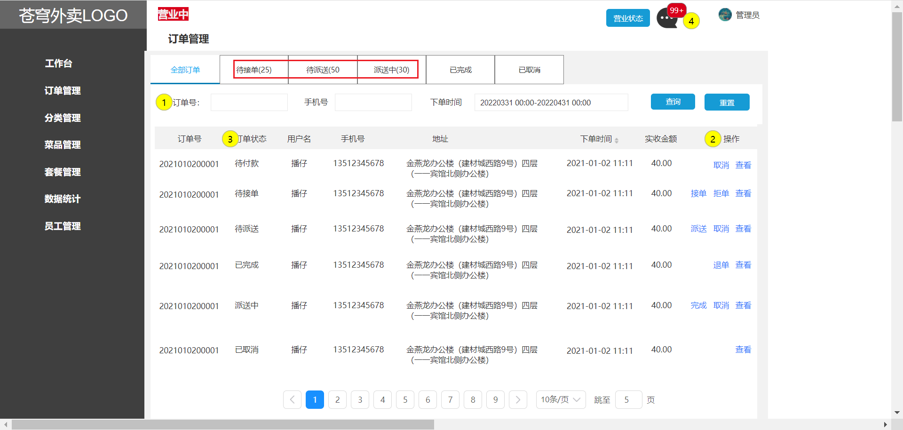

接口设计：参见接口文档

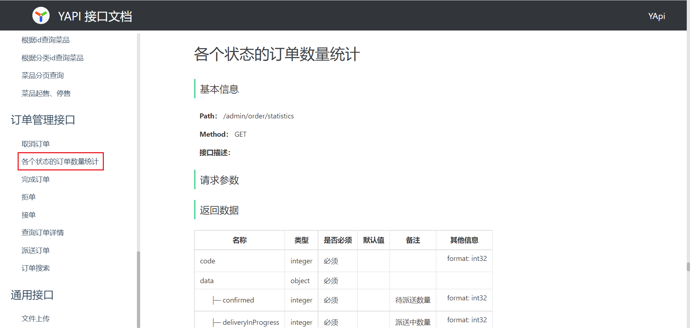

### 2.2 代码实现

#### 2.2.1 admin/OrderController

~~~java
    /**
     * 各个状态的订单数量统计
     *
     * @return
     */
    @GetMapping("/statistics")
    @ApiOperation("各个状态的订单数量统计")
    public Result<OrderStatisticsVO> statistics() {
        OrderStatisticsVO orderStatisticsVO = orderService.statistics();
        return Result.success(orderStatisticsVO);
    }
~~~

#### 2.2.2 OrderService

~~~java
    /**
     * 各个状态的订单数量统计
     * @return
     */
    OrderStatisticsVO statistics();
~~~

#### 2.2.3 OrderServiceImpl

~~~java
    /**
     * 各个状态的订单数量统计
     *
     * @return
     */
    public OrderStatisticsVO statistics() {
        // 根据状态，分别查询出待接单、待派送、派送中的订单数量
        Integer toBeConfirmed = orderMapper.countStatus(Orders.TO_BE_CONFIRMED);
        Integer confirmed = orderMapper.countStatus(Orders.CONFIRMED);
        Integer deliveryInProgress = orderMapper.countStatus(Orders.DELIVERY_IN_PROGRESS);

        // 将查询出的数据封装到orderStatisticsVO中响应
        OrderStatisticsVO orderStatisticsVO = new OrderStatisticsVO();
        orderStatisticsVO.setToBeConfirmed(toBeConfirmed);
        orderStatisticsVO.setConfirmed(confirmed);
        orderStatisticsVO.setDeliveryInProgress(deliveryInProgress);
        return orderStatisticsVO;
    }
~~~

#### 2.2.4 OrderMapper

~~~java
    /**
     * 根据状态统计订单数量
     * @param status
     */
    @Select("select count(id) from orders where status = #{status}")
    Integer countStatus(Integer status);
~~~

### 2.3 功能测试

略

## 3. 查询订单详情

### 3.1 需求分析和设计

产品原型：

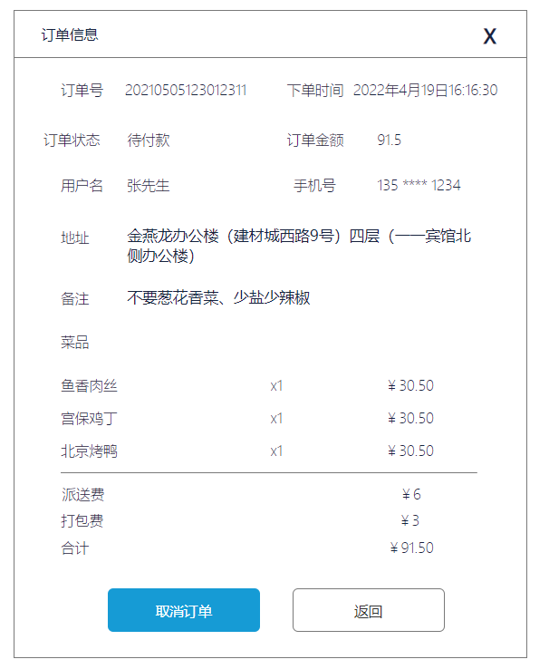

业务规则：

- 订单详情页面需要展示订单基本信息（状态、订单号、下单时间、收货人、电话、收货地址、金额等）
- 订单详情页面需要展示订单明细数据（商品名称、数量、单价）

接口设计：参见接口文档

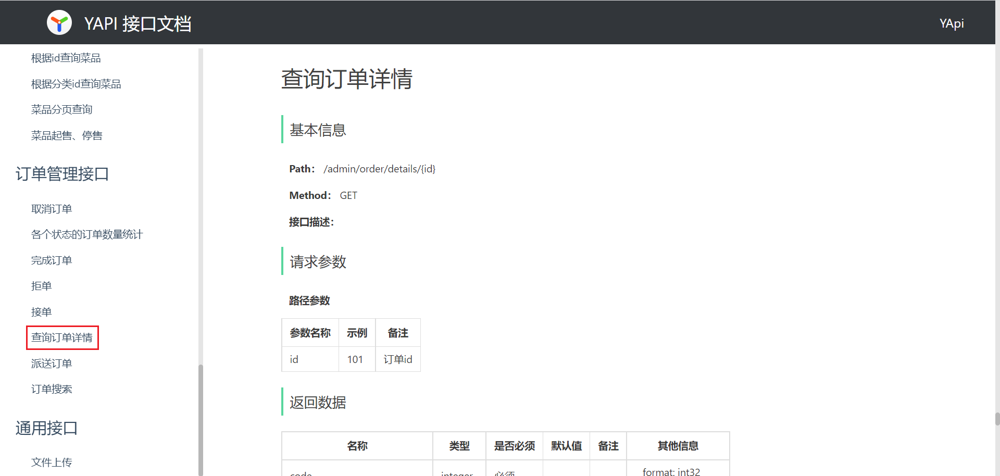

### 3.2 代码实现

#### 3.2.1 admin/OrderController

~~~java
    /**
     * 订单详情
     *
     * @param id
     * @return
     */
    @GetMapping("/details/{id}")
    @ApiOperation("查询订单详情")
    public Result<OrderVO> details(@PathVariable("id") Long id) {
        OrderVO orderVO = orderService.details(id);
        return Result.success(orderVO);
    }
~~~

### 3.3 功能测试

略

## 4. 接单

### 4.1 需求分析和设计

产品原型：

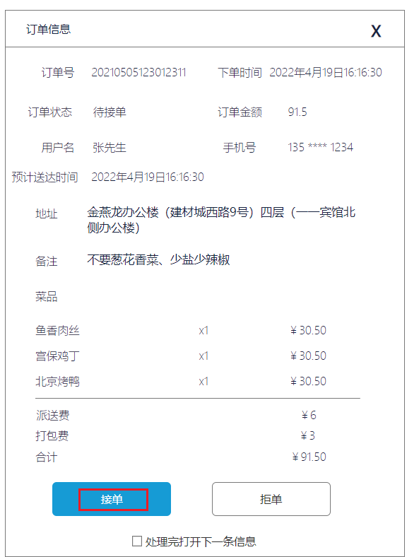

业务规则：

- 商家接单其实就是将订单的状态修改为“已接单”

接口设计：参见接口文档

### 4.2 代码实现

#### 4.2.1 admin/OrderController

~~~java
    /**
     * 接单
     *
     * @return
     */
    @PutMapping("/confirm")
    @ApiOperation("接单")
    public Result confirm(@RequestBody OrdersConfirmDTO ordersConfirmDTO) {
        orderService.confirm(ordersConfirmDTO);
        return Result.success();
    }
~~~

#### 4.2.2 OrderService

~~~java
    /**
     * 接单
     *
     * @param ordersConfirmDTO
     */
    void confirm(OrdersConfirmDTO ordersConfirmDTO);
~~~

#### 4.2.3 OrderServiceImpl

~~~java
    /**
     * 接单
     *
     * @param ordersConfirmDTO
     */
    public void confirm(OrdersConfirmDTO ordersConfirmDTO) {
        Orders orders = Orders.builder()
                .id(ordersConfirmDTO.getId())
                .status(Orders.CONFIRMED)
                .build();

        orderMapper.update(orders);
    }
~~~

### 4.3 功能测试

略

## 5. 拒单

### 5.1 需求分析和设计

产品原型：

业务规则：

- 商家拒单其实就是将订单状态修改为“已取消”
- 只有订单处于“待接单”状态时可以执行拒单操作
- 商家拒单时需要指定拒单原因
- 商家拒单时，如果用户已经完成了支付，需要为用户退款

接口设计：参见接口文档

### 5.2 代码实现

#### 5.2.1 admin/OrderController

~~~java
    /**
     * 拒单
     *
     * @return
     */
    @PutMapping("/rejection")
    @ApiOperation("拒单")
    public Result rejection(@RequestBody OrdersRejectionDTO ordersRejectionDTO) throws Exception {
        orderService.rejection(ordersRejectionDTO);
        return Result.success();
    }
~~~

#### 5.2.2 OrderService

~~~java
    /**
     * 拒单
     *
     * @param ordersRejectionDTO
     */
    void rejection(OrdersRejectionDTO ordersRejectionDTO) throws Exception;
~~~

#### 5.2.3 OrderServiceImpl

~~~java
	/**
     * 拒单
     *
     * @param ordersRejectionDTO
     */
    public void rejection(OrdersRejectionDTO ordersRejectionDTO) throws Exception {
        // 根据id查询订单
        Orders ordersDB = orderMapper.getById(ordersRejectionDTO.getId());

        // 订单只有存在且状态为2（待接单）才可以拒单
        if (ordersDB == null || !ordersDB.getStatus().equals(Orders.TO_BE_CONFIRMED)) {
            throw new OrderBusinessException(MessageConstant.ORDER_STATUS_ERROR);
        }

        //支付状态
        Integer payStatus = ordersDB.getPayStatus();
        if (payStatus == Orders.PAID) {
            //用户已支付，需要退款
            String refund = weChatPayUtil.refund(
                    ordersDB.getNumber(),
                    ordersDB.getNumber(),
                    new BigDecimal(0.01),
                    new BigDecimal(0.01));
            log.info("申请退款：{}", refund);
        }

        // 拒单需要退款，根据订单id更新订单状态、拒单原因、取消时间
        Orders orders = new Orders();
        orders.setId(ordersDB.getId());
        orders.setStatus(Orders.CANCELLED);
        orders.setRejectionReason(ordersRejectionDTO.getRejectionReason());
        orders.setCancelTime(LocalDateTime.now());

        orderMapper.update(orders);
    }
~~~

### 5.3 功能测试

略

## 6. 取消订单

### 6.1 需求分析和设计

产品原型：

业务规则：

- 取消订单其实就是将订单状态修改为“已取消”
- 商家取消订单时需要指定取消原因
- 商家取消订单时，如果用户已经完成了支付，需要为用户退款

接口设计：参见接口文档

### 6.2 代码实现

#### 6.2.1 admin/OrderController

~~~java
    /**
     * 取消订单
     *
     * @return
     */
    @PutMapping("/cancel")
    @ApiOperation("取消订单")
    public Result cancel(@RequestBody OrdersCancelDTO ordersCancelDTO) throws Exception {
        orderService.cancel(ordersCancelDTO);
        return Result.success();
    }
~~~

#### 6.2.2 OrderService

~~~java
    /**
     * 商家取消订单
     *
     * @param ordersCancelDTO
     */
    void cancel(OrdersCancelDTO ordersCancelDTO) throws Exception;
~~~

#### 6.2.3 OrderServiceImpl

~~~java
	/**
     * 取消订单
     *
     * @param ordersCancelDTO
     */
    public void cancel(OrdersCancelDTO ordersCancelDTO) throws Exception {
        // 根据id查询订单
        Orders ordersDB = orderMapper.getById(ordersCancelDTO.getId());

        //支付状态
        Integer payStatus = ordersDB.getPayStatus();
        if (payStatus == 1) {
            //用户已支付，需要退款
            String refund = weChatPayUtil.refund(
                    ordersDB.getNumber(),
                    ordersDB.getNumber(),
                    new BigDecimal(0.01),
                    new BigDecimal(0.01));
            log.info("申请退款：{}", refund);
        }

        // 管理端取消订单需要退款，根据订单id更新订单状态、取消原因、取消时间
        Orders orders = new Orders();
        orders.setId(ordersCancelDTO.getId());
        orders.setStatus(Orders.CANCELLED);
        orders.setCancelReason(ordersCancelDTO.getCancelReason());
        orders.setCancelTime(LocalDateTime.now());
        orderMapper.update(orders);
    }
~~~

### 6.3 功能测试

略

## 7. 派送订单

### 7.1 需求分析和设计

产品原型：

业务规则：

- 派送订单其实就是将订单状态修改为“派送中”
- 只有状态为“待派送”的订单可以执行派送订单操作

接口设计：参见接口文档

### 7.2 代码实现

#### 7.2.1 admin/OrderController

~~~java
    /**
     * 派送订单
     *
     * @return
     */
    @PutMapping("/delivery/{id}")
    @ApiOperation("派送订单")
    public Result delivery(@PathVariable("id") Long id) {
        orderService.delivery(id);
        return Result.success();
    }
~~~

#### 7.2.2 OrderService

~~~java
    /**
     * 派送订单
     *
     * @param id
     */
    void delivery(Long id);
~~~

#### 7.2.3 OrderServiceImpl

~~~java
    /**
     * 派送订单
     *
     * @param id
     */
    public void delivery(Long id) {
        // 根据id查询订单
        Orders ordersDB = orderMapper.getById(id);

        // 校验订单是否存在，并且状态为3
        if (ordersDB == null || !ordersDB.getStatus().equals(Orders.CONFIRMED)) {
            throw new OrderBusinessException(MessageConstant.ORDER_STATUS_ERROR);
        }

        Orders orders = new Orders();
        orders.setId(ordersDB.getId());
        // 更新订单状态,状态转为派送中
        orders.setStatus(Orders.DELIVERY_IN_PROGRESS);

        orderMapper.update(orders);
    }
~~~

### 7.3 功能测试

略

## 8. 完成订单

### 8.1 需求分析和设计

产品原型：

业务规则：

- 完成订单其实就是将订单状态修改为“已完成”
- 只有状态为“派送中”的订单可以执行订单完成操作

接口设计：参见接口文档

### 8.2 代码实现

#### 8.2.1 admin/OrderController

~~~java
    /**
     * 完成订单
     *
     * @return
     */
    @PutMapping("/complete/{id}")
    @ApiOperation("完成订单")
    public Result complete(@PathVariable("id") Long id) {
        orderService.complete(id);
        return Result.success();
    }
~~~

#### 8.2.2 OrderService

~~~java
    /**
     * 完成订单
     *
     * @param id
     */
    void complete(Long id);
~~~

#### 8.2.3 OrderServiceImpl

~~~java
    /**
     * 完成订单
     *
     * @param id
     */
    public void complete(Long id) {
        // 根据id查询订单
        Orders ordersDB = orderMapper.getById(id);

        // 校验订单是否存在，并且状态为4
        if (ordersDB == null || !ordersDB.getStatus().equals(Orders.DELIVERY_IN_PROGRESS)) {
            throw new OrderBusinessException(MessageConstant.ORDER_STATUS_ERROR);
        }

        Orders orders = new Orders();
        orders.setId(ordersDB.getId());
        // 更新订单状态,状态转为完成
        orders.setStatus(Orders.COMPLETED);
        orders.setDeliveryTime(LocalDateTime.now());

        orderMapper.update(orders);
    }
~~~

### 8.3 功能测试

略

# 校验收货地址是否超出配送范围

## 1. 环境准备

注册账号：https://passport.baidu.com/v2/?reg&tt=1671699340600&overseas=&gid=CF954C2-A3D2-417F-9FE6-B0F249ED7E33&tpl=pp&u=https%3A%2F%2Flbsyun.baidu.com%2Findex.php%3Ftitle%3D%E9%A6%96%E9%A1%B5

登录百度地图开放平台：https://lbsyun.baidu.com/

进入控制台，创建应用，获取AK：

相关接口:

https://lbsyun.baidu.com/index.php?title=webapi/guide/webservice-geocoding

https://lbsyun.baidu.com/index.php?title=webapi/directionlite-v1

## 2. 代码开发

### 2.1 application.yml

配置外卖商家店铺地址和百度地图的AK：

### 2.2 OrderServiceImpl

改造OrderServiceImpl，注入上面的配置项：

~~~java
    @Value("${sky.shop.address}")
    private String shopAddress;

    @Value("${sky.baidu.ak}")
    private String ak;
~~~

在OrderServiceImpl中提供校验方法：

~~~java
/**
     * 检查客户的收货地址是否超出配送范围
     * @param address
     */
    private void checkOutOfRange(String address) {
        Map map = new HashMap();
        map.put("address",shopAddress);
        map.put("output","json");
        map.put("ak",ak);

        //获取店铺的经纬度坐标
        String shopCoordinate = HttpClientUtil.doGet("https://api.map.baidu.com/geocoding/v3", map);

        JSONObject jsonObject = JSON.parseObject(shopCoordinate);
        if(!jsonObject.getString("status").equals("0")){
            throw new OrderBusinessException("店铺地址解析失败");
        }

        //数据解析
        JSONObject location = jsonObject.getJSONObject("result").getJSONObject("location");
        String lat = location.getString("lat");
        String lng = location.getString("lng");
        //店铺经纬度坐标
        String shopLngLat = lat + "," + lng;

        map.put("address",address);
        //获取用户收货地址的经纬度坐标
        String userCoordinate = HttpClientUtil.doGet("https://api.map.baidu.com/geocoding/v3", map);

        jsonObject = JSON.parseObject(userCoordinate);
        if(!jsonObject.getString("status").equals("0")){
            throw new OrderBusinessException("收货地址解析失败");
        }

        //数据解析
        location = jsonObject.getJSONObject("result").getJSONObject("location");
        lat = location.getString("lat");
        lng = location.getString("lng");
        //用户收货地址经纬度坐标
        String userLngLat = lat + "," + lng;

        map.put("origin",shopLngLat);
        map.put("destination",userLngLat);
        map.put("steps_info","0");

        //路线规划
        String json = HttpClientUtil.doGet("https://api.map.baidu.com/directionlite/v1/driving", map);

        jsonObject = JSON.parseObject(json);
        if(!jsonObject.getString("status").equals("0")){
            throw new OrderBusinessException("配送路线规划失败");
        }

        //数据解析
        JSONObject result = jsonObject.getJSONObject("result");
        JSONArray jsonArray = (JSONArray) result.get("routes");
        Integer distance = (Integer) ((JSONObject) jsonArray.get(0)).get("distance");

        if(distance > 5000){
            //配送距离超过5000米
            throw new OrderBusinessException("超出配送范围");
        }
    }
~~~

在OrderServiceImpl的submitOrder方法中调用上面的校验方法：

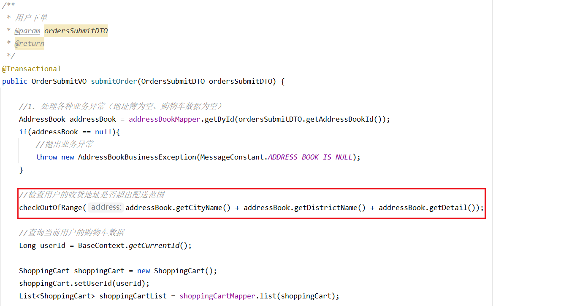